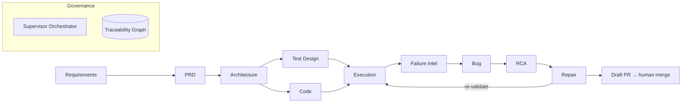

# Design: Agents & Skills for developer-assistant-skills

This is the **authoritative design** for the consolidated agent/skill set. It is not a copy of any
source — it merges the **EASE-MAS** closed-loop architecture (the backbone) with the best,
non-overlapping practices from **sunshine** (specialist critics, deliberation, evals, permission
ladder), **ppengsysquality** (Playwright + a11y execution skills), and **power-pages TPA**
(requirement→test-plan, semantic drift, eval framework). Provenance and rename tables live in
[skill-sources.md](skill-sources.md); this file defines *what to build and why*.

## 1. Principles

1. **Closed loop, not a pipeline.** Generation and validation feed each other; failures become
   structured evidence that drives diagnosis and bounded repair (EASE-MAS §1.2).
2. **Every generator has an independent critic.** Separation of duties reduces correlated error
   (EASE-MAS H3).
3. **Traceability is first-class.** One queryable graph links requirement → … → repair (H5).
4. **Bounded autonomy.** Explicit limits + regression gate; **merge stays human-owned** (H6).
5. **One skill per goal.** Consolidate duplicates; a skill does one thing, an agent orchestrates
   several.
6. **Open-source & generic.** No ADO / Power Platform / MAS / S360 / internal endpoints.

## 1a. Tool chain (CLI-first, MCP-fallback)

Skills use a **CLI-first, MCP-fallback** model (`config.toolchain`). The git/issue **provider is
pluggable** — GitHub (`gh` CLI / GitHub MCP) is the open-source default; Azure DevOps
(`az devops` / ADO MCP) is an optional, disabled plug-in. Playwright uses the **CLI** for
deterministic CI execution (A14) and the **MCP** for interactive exploration. `axe` powers WCAG
scans. Authenticated test environments (base URL + none/storage-state/basic/cert/oidc) come from
`config.test_environments`, with credentials in env vars only. See `.developer/mcp/README.md`.

## 2. Architecture (EASE-MAS backbone)

- **Orchestrator (Supervisor + DAG):** decomposes work into a DAG, picks the agent per node, runs
  it sandboxed, and gates on the paired critic; retries within budget, escalates to a human
  otherwise. One back-edge only: **Repair → Execution** (the closed loop). All communication is via
  typed artifacts in the graph, not free-form chat.
- **Traceability graph `G`:** the shared memory. Node + edge schema in §6.
- **Permission ladder (L0–L4):** L0 read-only · L1 recommend · L2 execute+human-approve ·
  L3 bounded autonomous (flake/selector repair, triage) · L4 autonomous+governance (narrow, low
  risk). Merge is never automated.

## 3. Consolidation strategy (how duplicates were merged)

| Overlap across sources | Decision |
|------------------------|----------|
| Code review: sunshine `code-review`+14 specialists · EASE-MAS A8/A9 · ppengsys agents | **One `code-review` skill** that dispatches **specialist *critic agents*** and runs `deliberate`. Specialists = the roster below. |
| Bug triage: EASE-MAS A18 · ppengsys `bug-triage` | **One `bug-triage` agent** + `triage-bug` skill. |
| Repair: EASE-MAS A20/A21/A22 · ppengsys `fix-bug`/`fix-test`/`bug-exterminator` · sunshine `implement-change` | `implement-change` for human-directed edits; `fix-bug`/`fix-test` for defect repair; **`repair-validator` agent** is the independent gate (A21); regression is a step, not a separate skill. |
| Test authoring: EASE-MAS A13/A14 · ppengsys `author/update/verify-test` · a11y `a11y-test-gen` | Keep `author-test`/`update-test`/`verify-test`; `a11y-test-gen` stays distinct (axe-core focus). |
| Test planning: EASE-MAS A10–A12 · power-pages agent4 · ppengsys `validate-scenario` | `test-plan` (strategy+plan+cases) + `validate-scenario` (test↔spec drift, incl. **semantic-drift** metric from power-pages). |
| Requirements/PRD: EASE-MAS A1–A5 · sunshine `start-feature`/`grade-spec` · power-pages PRD extractor | `from-requirements` (ingest→normalize→PRD) + `grade-spec` (critic); `start-feature` orchestrates them. |
| a11y reviews: 5 ppengsys `a11y-review-*` | **One `a11y-review`** with modes (contrast/color/links/modes/viewports). |
| a11y scan: `a11y-scan-repo`+`a11y-scan-url` | **One `a11y-scan`** with static/runtime modes. |
| Flaky tests: engsys `flaky-detect/fix` (internal) | **New generic `flaky-test`** (detect+quarantine+fix). |

## 4. Final agent roster (`.developer/agents/`)

Agents orchestrate or act as **independent critics**. EASE-MAS mapping in brackets; source lineage
after the em-dash.

### Orchestration & traceability
- **supervisor** [Supervisor] — DAG decomposition, agent selection, retries, HITL, termination — EASE-MAS.
- **traceability-keeper** [G] — writes/queries the requirement→…→repair graph — EASE-MAS (new).

### Generation-side leads (thin orchestrators over skills)
- **feature-lead** [A1–A7] — requirements → PRD → architecture → code — sunshine `start-feature` + EASE-MAS.
- **test-engineer** [A10–A14] — strategy → plan → cases → automation → execution — ppengsys + EASE-MAS.
- **bug-exterminator** [A19–A22] — RCA → bounded repair → regression → draft PR — ppengsys + EASE-MAS.
- **bug-triage** [A17/A18] — classify failures → structured bug → severity/owner/dedup — ppengsys + EASE-MAS.

### Independent critics (the review roster — sunshine + EASE-MAS A5/A8/A9/A21)
- **prd-critic** [A5] — PRD completeness/consistency/testability — EASE-MAS (new).
- **code-reviewer** [A8] — correctness & quality gate — sunshine `code-review` core.
- **security-advocate** [A9] — trust, authz, injection, secrets, supply chain — sunshine.
- **repair-validator** [A21] — independent accept/reject of a patch (separation from repair) — EASE-MAS (new).
- **architecture-advocate** — boundaries, modularity, contracts — sunshine.
- **accessibility-advocate** — WCAG, keyboard, focus, semantics — sunshine + a11y.
- **performance-advocate** — runtime, memory, bundle, network — sunshine.
- **unit-testing-advocate** — contracts, equivalence classes, coverage — sunshine.
- **e2e-test-author** — user journeys, fixtures, flake resistance — sunshine.
- **manual-tester** — exploratory, boundary conditions — sunshine.
- **observability-advocate** — signals, schemas, privacy — sunshine.
- **dependency-manager** — updates, advisories, licenses — sunshine.
- **style-guardian** — design tokens, responsive, motion — sunshine.
- **internationalization-expert** — locale, RTL, translation — sunshine.
- **documentation-steward** — doc drift, public contracts — sunshine.
- **refactorer** — duplication, abstraction thresholds — sunshine.
- **debugger** — reproduce, isolate root cause — sunshine (pairs with `analyze-bug`/`root-cause`).

> `code-review` (skill) dispatches the relevant critics for a diff, then `deliberate` renders a
> verdict (Take Action / Stand Down / Defer / Escalate). No majority vote.

## 5. Final skill catalog (`.developer/skills/<group>/<skill>`)

Each ships as `SKILL.md` (Role → Context → Step 0 TodoWrite → Steps) + a `/dev:<name>` command.
"Source" = primary lineage; "[Axx]" = EASE-MAS agent it realizes.

### requirements/
- **from-requirements** [A1–A4] — ingest NL/MD/PDF/DOCX/issues → normalized requirements → PRD with traceability — power-pages + EASE-MAS.
- **grade-spec** [A5] — score a spec/PRD for completeness, ambiguity, testability — sunshine.

### architecture/
- **architecture-doc** [A6] — components, APIs, data model, NFR→PRD mapping — sunshine.
- **graph-repo** — **NEW**: build a code graph (modules, files, symbols, imports, call/dep edges) → queryable JSON + mermaid/HTML; powers impact analysis for review/refactor/repair.
- **threat-model** [§14] — STRIDE-style threats + mitigations — sunshine (generic).

### design/
- **design-spec** — component/design-system spec from a brief — sunshine fluent-x (generalized).
- **from-figma** — design tokens/spec from a Figma reference (optional MCP) — sunshine (generalized).

### development/
- **start-feature** [A1–A7] — spec → architecture → plan → human approval → scaffold — sunshine.
- **implement-change** — bug fix/improvement from reproduction to local validation — sunshine.
- **refactor** — duplication/abstraction cleanup within ownership limits — sunshine.

### review/
- **code-review** [A8] — roster-driven specialist review of a diff/PR — sunshine.
- **deliberate** — evaluate findings → 4-outcome verdict — sunshine.
- **pr-learn** — extract durable lessons from merged PRs into memory — sunshine.

### testing/
- **test-plan** [A10–A12] — risk-based strategy → scenarios → canonical test cases with traceability — power-pages + EASE-MAS.
- **validate-scenario** — test↔spec drift incl. **semantic drift** metric — ppengsys + power-pages.
- **coverage-gap** — find untested requirements/paths — ppengsys.
- **flaky-test** [A16] — **NEW generic**: detect non-deterministic tests, quarantine, propose fix — engsys concept.
- **testing/playwright/** — all **Playwright-specific** skills grouped in one sub-folder (CLI-first, MCP-fallback; auth from `config.test_environments`):
  - **playwright-auth** — authenticate a test env → save reusable storage-state.
  - **run-tests** [A14] — deterministic CLI execution + artifact collection + traceability Execution/Failure nodes.
  - **author-test** [A13] — author a Playwright spec.
  - **verify-test** — verify a test is correct & non-flaky.
  - **update-test** — repair a drifted test (never mask a regression).

### debugging/
- **analyze-bug** [A15] — structured failure extraction (error, stack, logs, artifacts, diff correlation) — ppengsys + EASE-MAS.
- **root-cause** [A19] — ranked hypotheses (≥k) with evidence citations — EASE-MAS (new).
- **fix-bug** [A20] — bounded patch under safety limits + regression gate — ppengsys + EASE-MAS.
- **fix-test** — repair a failing/incorrect test — ppengsys.

### accessibility/
- **a11y-scan** — static (repo) or runtime (URL, axe) WCAG scan — ppengsys (merged).
- **a11y-review** — interactive/contrast/color/links/modes/viewports via modes — ppengsys (merged 6→1).
- **a11y-test-gen** — Playwright + axe-core a11y tests — ppengsys.
- **a11y-fix** — fix WCAG violations (WCAG-only, no MAS) — ppengsys.
- **a11y-verify** — verify a fix resolves the violation — ppengsys.

### quality/ (critic-backed skills, optional standalone)
- **security-review** [A9] · **performance-review** · **observability-review** · **dependency-review** — thin skills that invoke the matching advocate agent for a focused pass — sunshine.

### repo/
- **sweep-codebase** — bounded hygiene scan → deliberate → route approved work — sunshine.
- **docs-update** — reconcile docs with code/public contracts — sunshine.

### devops/
- **fix-ci** — diagnose and repair a broken CI pipeline — sunshine reference (generic).
- **release-readiness** [A23] — gate checklist + human sign-off — EASE-MAS.

## 6. Traceability graph schema (`output/traceability.json`)

**Nodes:** Requirement, PRDItem, ArchDecision, CodeSymbol, TestCase, Execution, Failure, Bug,
Hypothesis, Repair, Validation. Each node: `id`, `type`, `attrs`, `provenance`, `confidence`.

**Edges (typed, directed):** `derives`, `implements`, `tests`, `executes`, `fails`, `reports`,
`hypothesizes`, `repairs`, `validates`. Agents fetch the exact subgraph they need as context;
auditors traverse it for explainability (H5). `traceability-keeper` is the only writer.

## 7. Repair loop & safety (bounded autonomy)

Loop: select hypothesis → localize + patch → static/diff checks → sandbox apply → unit → targeted
E2E → regression → security scan → `repair-validator` gate. **Terminate** when: (a) failing test
passes ∧ regression green ∧ security clean ∧ validator accepts → **open draft PR**; or (b)
attempt/time/diff budget exhausted; or (c) repeated identical failures (mis-localized); or (d)
safety violation → abort + rollback + alert. Hard limits (from config `autonomy`): max files, max
diff, max attempts, wall-clock budget, no secret scope, no unapproved deps, feature-branch only,
human merge, one-click rollback.

## 8. Threat model (applied)

Prompt/issue/doc injection → treat external text as data, instruction hierarchy, output validation.
Tool/MCP poisoning → registry allow-list, scoped tokens, health checks. Secret leakage → secret
isolation, output scanning. Unauthorized changes → branch isolation + protected-branch CI.
Supply-chain → no unapproved deps + SCA. Least privilege + sandbox + audit throughout (§14).

## 9. Evaluation framework (`.developer/evals/`)

Adopt sunshine's fixture+rubric+regression-gate model, structured around EASE-MAS experiments:
per-skill fixtures with expected verdicts; **mutation score** as the primary test-adequacy metric;
regression gate blocks merges of `.developer/**` that lower eval scores (see `agent-evals.yml`).
Metrics tracked: task completion, correctness, requirement coverage, mutation score, defect
detection, RCA top-1/top-k, repair + first-attempt success, regression rate, human-intervention
count, cost, latency.

## 10. Mapping to CI workflows (already scaffolded)

| Workflow | Skills/agents it drives |
|----------|-------------------------|
| `autonomous-bug-fix` | `analyze-bug` → `fix-bug` (bounded) → draft PR |
| `autonomous-product-bug-fix` | `analyze-bug` → `root-cause` → `fix-bug` (+regression) via `bug-exterminator` |
| `autonomous-test-fix` | `fix-test` (from CI) / `flaky-test --fix` |
| `agent-code-review` | `code-review` → specialist critics → `deliberate` |
| `agent-evals` | `.developer/evals` regression gate |

## 11. Build order (phased)

1. **Critics + core review loop:** the 18 critic/advocate agents + `code-review`, `deliberate`.
2. **Dev core:** `start-feature`, `implement-change`, `refactor`, `sweep-codebase`, `pr-learn`.
3. **Testing + debugging:** `test-plan`, `author/update/verify-test`, `validate-scenario`,
   `coverage-gap`, `flaky-test`, `analyze-bug`, `root-cause`, `fix-bug`, `fix-test`.
4. **Accessibility:** `a11y-scan`, `a11y-review`, `a11y-test-gen`, `a11y-fix`, `a11y-verify`.
5. **Architecture/design:** `graph-repo`, `architecture-doc`, `threat-model`, `design-spec`, `from-figma`.
6. **Closed-loop layer:** `supervisor`, `traceability-keeper`, `bug-exterminator`, `repair-validator`,
   `from-requirements`, `grade-spec`, `release-readiness` + traceability graph.
7. **Packaging:** config templates, CLI, commands/prompts, adapters, evals, docs, npm publish.
